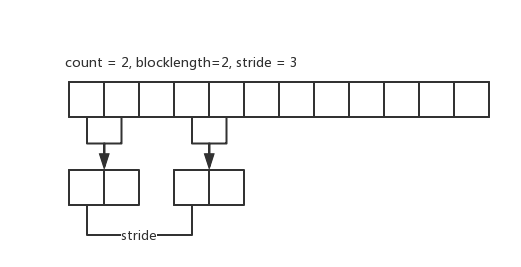

# MPI 数据类型
MPI 除了可以发送或接受连续的数据之外，还可以处理不连续的数据，其基本方法有两种，一是允许用户自定义新的数据类型（又称为派生数据类型），二是数据的打包与捷解包，即在发送方将不连续的数据打包到连续的区域，然后发送出去，在接收方将打包的连续数据解包到不连续的存储空间。

<!-- toc -->
## 派生数据类型
### 连续复制类型
通过 `MPI_Type_contiguous` 函数，我们可以把多个相同的数据类型合成一个数据类型，下面是函数原型：
```c
int MPI_Type_contiguous(
    int count,              // 旧类型的个数
    MPI_Datatype oldtype,   // 旧数据类型
    MPI_Datatype * newtype  // 新数据类型
)
```
下面是一个使用示例
```c
#include <stdio.h>
#include <stdlib.h>
#include "mpi.h"

typedef struct _contiguous_type{
    int a;
    int b;
} contiguous_type;

void cont_type() {
    int rank;
    contiguous_type data;
    MPI_Datatype newtype;
    MPI_Status status;
    MPI_Init(NULL, NULL);
    MPI_Comm_rank(MPI_COMM_WORLD, &rank);
    MPI_Type_contiguous(2, MPI_INT, &newtype);
    MPI_Type_commit(&newtype);
    if(rank == 0) {
        data.a = 1;
        data.b = 2;
        MPI_Send(&data, 1, newtype, 1, 99, MPI_COMM_WORLD);
    }

    if(rank == 1) {
        MPI_Recv(&data, 1, newtype, 0, 99, MPI_COMM_WORLD, &status);
        printf("data.a is %d and data.b is %d\n", data.a, data.b);
    }

    MPI_Finalize();
}

int main() {
    cont_type();
}
```
### 向量数据
`MPI_Type_vector` 允许复制的数据之间有空隙，下面是函数原型：
```c
int MPI_Type_vector(
    int count,              // 块的数量
    int blocklength,        // 每个块中所含元素的个数
    int stride,             // 各块第一个元素之间相隔的元素数
    MPI_Datatype oldtype,   // 旧数据类型
    MPI_Datatype *newtype   // 新数据类型
)
```
为了更加直观的理解，我们给出 `count=2, blocklength=2, stride=3` 时的示例图。上面的是原始数据，下面的新数据类型所包含的数据。


`MPI_Type_hvector` 和 `MPI_Type_vector` 功能类似，只不过 `MPI_Type_hvector` 针对的是字节，下面是函数原型：
```c
int MPI_Type_hvector(
    int count,              // 块的数量
    int blocklength,        // 每个块中所含元素的个数
    int stride,             // 各块第一个元素之间相隔的字节数
    MPI_Datatype oldtype,   // 旧数据类型
    MPI_Datatype *newtype   // 新数据类型
)
```
下面是使用 `MPI_Type_vector` 的一个使用示例：
```c
void vector_type() {
    int rank;
    int n = 10;
    int buffer[10];
    int i;
    MPI_Datatype newtype;
    MPI_Status status;
    MPI_Init(NULL, NULL);
    MPI_Comm_rank(MPI_COMM_WORLD, &rank);
    MPI_Type_vector(2, 2, 3, MPI_INT, &newtype);
    MPI_Type_commit(&newtype);
    if(rank == 0) {
        for(i = 0; i < n; i++) {
            buffer[i] = i + 1;
        }
        MPI_Send(&buffer, 1, newtype, 1, 99, MPI_COMM_WORLD);
    }
    if(rank == 1) {

        for(int i = 0; i < n; i++) {
            buffer[i] = 100;
        }
        MPI_Recv(&buffer, 1, newtype, 0, 99, MPI_COMM_WORLD, &status);
        for(i = 0; i < n; i++) {
            printf("buffer[%d] is %d\n", i, buffer[i]);
        }
    }
    MPI_Finalize();
}
```
