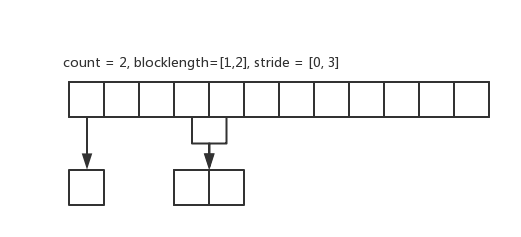

# MPI 数据类型
MPI 除了可以发送或接受连续的数据之外，还可以处理不连续的数据，其基本方法有两种，一是允许用户自定义新的数据类型（又称为派生数据类型），二是数据的打包与捷解包，即在发送方将不连续的数据打包到连续的区域，然后发送出去，在接收方将打包的连续数据解包到不连续的存储空间。

<!-- toc -->
## 派生数据类型
### 连续复制类型
通过 `MPI_Type_contiguous` 函数，我们可以把多个相同的数据类型合成一个数据类型，下面是函数原型：
```c
int MPI_Type_contiguous(
    int count,              // 旧类型的个数
    MPI_Datatype oldtype,   // 旧数据类型
    MPI_Datatype * newtype  // 新数据类型
)
```
下面是一个使用示例
```c
#include <stdio.h>
#include <stdlib.h>
#include "mpi.h"

typedef struct _contiguous_type{
    int a;
    int b;
} contiguous_type;

void cont_type() {
    int rank;
    contiguous_type data;
    MPI_Datatype newtype;
    MPI_Status status;
    MPI_Init(NULL, NULL);
    MPI_Comm_rank(MPI_COMM_WORLD, &rank);
    MPI_Type_contiguous(2, MPI_INT, &newtype);
    MPI_Type_commit(&newtype);
    if(rank == 0) {
        data.a = 1;
        data.b = 2;
        MPI_Send(&data, 1, newtype, 1, 99, MPI_COMM_WORLD);
    }

    if(rank == 1) {
        MPI_Recv(&data, 1, newtype, 0, 99, MPI_COMM_WORLD, &status);
        printf("data.a is %d and data.b is %d\n", data.a, data.b);
    }

    MPI_Finalize();
}

int main() {
    cont_type();
}
```
### 向量数据
`MPI_Type_vector` 允许复制的数据之间有空隙，下面是函数原型：
```c
int MPI_Type_vector(
    int count,              // 块的数量
    int blocklength,        // 每个块中所含元素的个数
    int stride,             // 各块第一个元素之间相隔的元素数
    MPI_Datatype oldtype,   // 旧数据类型
    MPI_Datatype *newtype   // 新数据类型
)
```
为了更加直观的理解，我们给出 `count=2, blocklength=2, stride=3` 时的示例图。上面的是原始数据，下面的新数据类型所包含的数据。


`MPI_Type_hvector` 和 `MPI_Type_vector` 功能类似，只不过 `MPI_Type_hvector` 针对的是字节，下面是函数原型：
```c
int MPI_Type_hvector(
    int count,              // 块的数量
    int blocklength,        // 每个块中所含元素的个数
    int stride,             // 各块第一个元素之间相隔的字节数
    MPI_Datatype oldtype,   // 旧数据类型
    MPI_Datatype *newtype   // 新数据类型
)
```
下面是使用 `MPI_Type_vector` 的一个使用示例：
```c
void vector_type() {
    int rank;
    int n = 10;
    int buffer[10];
    int i;
    MPI_Datatype newtype;
    MPI_Status status;
    MPI_Init(NULL, NULL);
    MPI_Comm_rank(MPI_COMM_WORLD, &rank);
    MPI_Type_vector(2, 2, 3, MPI_INT, &newtype);
    MPI_Type_commit(&newtype);
    if(rank == 0) {
        for(i = 0; i < n; i++) {
            buffer[i] = i + 1;
        }
        MPI_Send(&buffer, 1, newtype, 1, 99, MPI_COMM_WORLD);
    }
    if(rank == 1) {

        for(int i = 0; i < n; i++) {
            buffer[i] = 100;
        }
        MPI_Recv(&buffer, 1, newtype, 0, 99, MPI_COMM_WORLD, &status);
        for(i = 0; i < n; i++) {
            printf("buffer[%d] is %d\n", i, buffer[i]);
        }
    }
    MPI_Finalize();
}
```
### 索引数据类型
索引数据类型更加灵活，可以分别指定每个块中的数据量以及每个块的起始位置，下面是函数原型
```c
int MPI_Type_indexed(
    int count,                          // 块的数量
    int * array_of_blocklengths,        // 每个块中所含元素的个数
    int * array_of_displacements,       // 各块偏移字节
    MPI_Datatype oldtype,               // 旧数据类型
    MPI_Datatype *newtype               // 新数据类型
)
```
下面是 `count=2, array_of_blocklengths=[1,2], array_of_displacements=[0,3]` 的示意图：


下面是函数用法示例：
```c
void index_type() {
    int rank;
    int n = 10;
    int buffer[10];
    int blocklength[2];
    int index[2];
    int i;
    MPI_Datatype newtype;
    MPI_Status status;
    MPI_Init(NULL, NULL);
    MPI_Comm_rank(MPI_COMM_WORLD, &rank);

    blocklength[0] = 1;
    blocklength[1] = 2;
    index[0] = 0;
    index[1] = 3;
    MPI_Type_indexed(2, blocklength, index, MPI_INT, &newtype);
    MPI_Type_commit(&newtype);
    if(rank == 0) {
        for(i = 0; i < n; i++) {
            buffer[i] = i + 1;
        }

        MPI_Send(&buffer, 1, newtype, 1, 99, MPI_COMM_WORLD);
    }

    if(rank == 1) {

        for(int i = 0; i < n; i++) {
            buffer[i] = 100;
        }
        MPI_Recv(&buffer, 1, newtype, 0, 99, MPI_COMM_WORLD, &status);
        for(i = 0; i < n; i++) {
            printf("buffer[%d] is %d\n", i, buffer[i]);
        }
    }
    MPI_Finalize();
}
```
### 结构体数据类型
使用`MPI_Type_struct` 可以生成结构体类型，下面是函数原型
```c
int MPI_Type_struct(
    int count,                          // 块的数量
    int * array_of_blocklengths,        // 每个块中所含元素的个数
    MPI_Aint * array_of_displacements,  // 各块偏移字节（注意是字节）
    MPI_Datatype oldtype,               // 旧数据类型
    MPI_Datatype *newtype               // 新数据类型
)
```
下面是使用示例
```c
typedef struct _my_struct {
    double d;
    double d2;
    int i;
    char c;
} my_struct;

void  struct_type() {
    int rank;
    int blocklength[3];
    MPI_Aint index[3];
    MPI_Datatype oldtype[3];
    MPI_Datatype newtype;
    MPI_Status status;
    my_struct data;

    MPI_Init(NULL, NULL);
    MPI_Comm_rank(MPI_COMM_WORLD, &rank);

    blocklength[0] = 2;
    blocklength[1] = 1;
    blocklength[2] = 1;
    index[0] = 0;
    index[1] = sizeof(MPI_DOUBLE) * 2;
    index[2] = sizeof(MPI_DOUBLE) * 2 + sizeof(MPI_INT);
    oldtype[0] = MPI_DOUBLE;
    oldtype[1] = MPI_INT;
    oldtype[2] = MPI_CHAR;

    MPI_Type_struct(3, blocklength, index, oldtype, &newtype);
    MPI_Type_commit(&newtype);
    if(rank == 0) {
        data.d = 2.0;
        data.d2 = 3.5;
        data.i = 4;
        data.c = 'c';
        MPI_Send(&data, 1, newtype, 1, 99, MPI_COMM_WORLD);
    }
    if(rank == 1) {
        MPI_Recv(&data, 1, newtype, 0, 99, MPI_COMM_WORLD, &status);
        printf("data.d is %.2f, data.d2 is %.2f, i is %d, data.c is %c\n", data.d, data.d2, data.i, data.c);
    }
    MPI_Finalize();
}
```
### 新类型递交和释放
新定义的数据在使用之前，必须先使用`MPI_Type_commit` 递交给 MPI 系统，下面是函数原型：
```c
int MPI_Type_commit(MPI_Datatype * datatype)
```
如果需要释放已经递交的数据类型，可以使用`MPI_Type_free`，下面是函数原型：
```c
int MPI_Type_free(MPI_Datatype * datatype)
```
### 地址函数
`MPI_ADdress` 可以返回一个变量在内存中相对于预定义的地址 `MPI_BOTTOM` 偏移地址，下面是函数原型:
```c
int MPI_ADdress(
    void * location,    // 内存地址
    MPI_Aint *address   // 相对于位置 MPI_BOTTOM 的偏移
)
```
下面是使用方法
```c
int buf[10];
MPI_Aint a1, a2;
MPI_Get_address( &buf[0], &a1 );
MPI_Get_address( &buf[1], &a2 );
```
### 相关函数
`MPI_Type_extent` 以字节为单位返回一个数据类型的跨度 extent，下面是函数原型
```c
int MPI_Type_extent(
    MPI_Datatype datatype,  // 数据类型
    MPI_Aint * extent       // 数据类型跨度
)
```
`MPI_Type_size` 以字节为单位，返回给定数据有用部分所占空间的大小，即跨度减去类型中的空隙后的空间大小，和 `MPI_Type_extent` 相比，`MPI_Type_size` 不包括由于对齐等原因导致的数据类型中的空隙所占的空间。下面是 `MPI_Type_size` 的函数原型：
```c
int MPI_Type_size(
    MPI_Datatype datatype,  // 数据类型
    int * size              // 数据类型跨度
)
```
通过 `MPI_Get_count` 和 `MPI_Get_elements` 可以返回接收的数据的个数，下面是两者的函数原型：
```c
int MPI_Get_elements(
    MPI_Status * status,    // 接收操作返回的状态
    MPI_Datatype datatype,  // 接收操作使用的数据类型
    int *count              // 接收到的基本类型元素的个数
)

int MPI_Get_count(
    MPI_Status * status,    // 接收操作返回的状态
    MPI_Datatype datatype,  // 接收操作使用的数据类型
    int *count              // 接收到的指定数据类型的个数
)
```
`MPI_Get_elements` 和 `MPI_Get_count` 不同的是，前者是以基本类型元素为单位的，后者是以指定的数据类型为单位的，假设接收一个结构体，结构体的定义如下
```c
typedef struct _my_struct {
    double d;
    double d2;
    int i;
    char c;
} my_struct;
```
那么使用 `MPI_Get_elements` 返回的结果就是 4 (两个 double， 一个int，一个char)，而使用 `MPI_Get_count` 返回的结果则是 1 。

## 打包和解包
打包和解包是另外一种灵活发送数据的方式，在发送之前显式的将数据包装到一个连续的缓冲区中，在接受之后从连续缓冲区中解包。

`MPI_Pack` 完成打包操作，它首先将数据放到一个缓冲区中，发送时会发送该缓冲区。下面是函数原型：
```c
int MPI_Pack(
    void * inbuf,           // 输入缓冲区的起始地址
    int incount,            // 输入数据的个数
    MPI_Datatype datatype,  // 每个输入数据的类型
    void * packbuf,         // 打包缓冲区的起始地址
    int outcount,           // 打包缓冲区的大小
    int * position,         // 缓冲区当前的位置
    MPI_Comm comm           // 通信域
)
```
`MPI_Unpack` 完成解包操作，它把数据首先接收到解包缓冲区里，然后在把解包缓冲区的数据解包成对应的值。下面是函数原型：
```c
int MPI_Unpack(
    void * packbuf,         // 解包缓冲区的起始地址
    int insize,             // 解包缓冲区的大小
    int *position,          // 缓冲区当前位置
    void * outbuf,          // 解包数据的起始地址
    int outcount,           // 解包数据的个数
    MPI_Datatype datatype,  // 解包数据的类型
    MPI_Comm comm           // 通信域
)
```
通过对不同位置的数据调用打包操作，就可以将不连续的消息放到一个连续的空间里。同理通过多次调用解包操作，就可以将缓冲区的数据解包到不同的位置。需要注意的一点是在发送和接收的时候数据类型要使用`MPI_PACKED`

`MPI_Pack_size` 可以计算打包 incount 个 datatype 数据类型需要空间的大小。该调用返回的是一个上界，而不是一个精确界，这是因为包装一个消息所需的精确空间可能依赖于上下文。下面是函数原型：
```c
int MPI_Pack_size(
    int incount,            // 指定的数据类型的个数
    MPI_Datatype datatype,  // 数据类型
    MPI_Comm comm,          // 通信域
    int * size              // 以字节为单位，incount 个 datatype 数据类型数据需要的空间
)
```
下面是使用 `MPI_Pack` 和 `MPI_Unpack`的一个示例
```c
#include <stdio.h>
#include <stdlib.h>
#include "mpi.h"

void pack_and_unpack() {
    int rank;
    int i;
    double d;
    char c;
    char buffer[20];
    int position = 0;
    MPI_Status status;
    MPI_Init(NULL, NULL);
    MPI_Comm_rank(MPI_COMM_WORLD, &rank);
    if(rank == 0) {
        i = 1;
        d = 4.5;
        c = 'a';
        MPI_Pack(&i, 1, MPI_INT, buffer, 20, &position, MPI_COMM_WORLD);
        MPI_Pack(&d, 1, MPI_DOUBLE, buffer, 20, &position, MPI_COMM_WORLD);
        MPI_Pack(&c, 1, MPI_CHAR, buffer, 20, &position, MPI_COMM_WORLD);
        printf("postion is %d\n", position);
        MPI_Send(buffer, position, MPI_PACKED, 1, 99, MPI_COMM_WORLD);
    }

    if(rank == 1) {
        MPI_Recv(buffer, 20, MPI_PACKED, 0, 99, MPI_COMM_WORLD, &status);
        MPI_Unpack(buffer, 20, &position, &i, 1, MPI_INT, MPI_COMM_WORLD);
        MPI_Unpack(buffer, 20, &position, &d, 1, MPI_DOUBLE, MPI_COMM_WORLD);
        MPI_Unpack(buffer, 20, &position, &c, 1, MPI_CHAR, MPI_COMM_WORLD);

        printf("i is %d, d id %.2f, c is %c\n", i, d, c);
    }
    MPI_Finalize();
}

int main() {
   pack_and_unpack();
}
```
