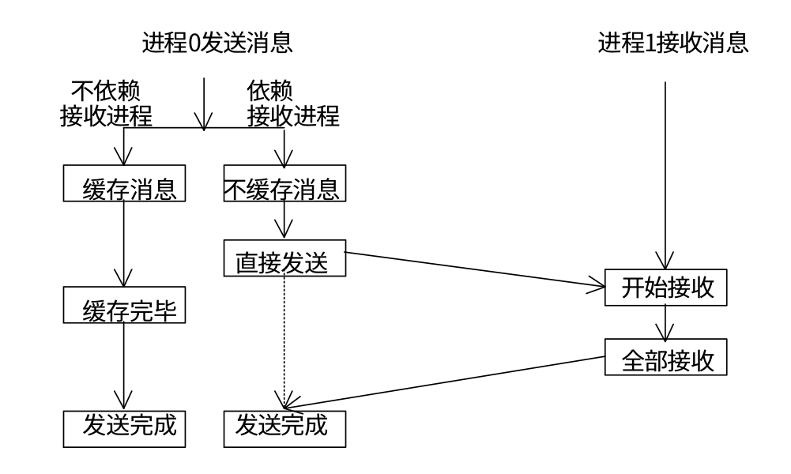
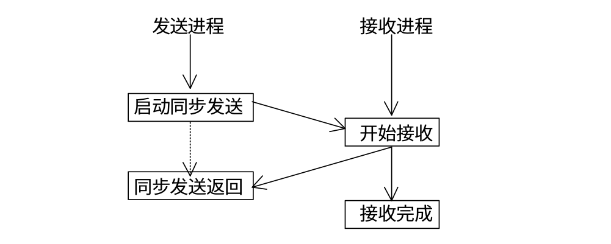
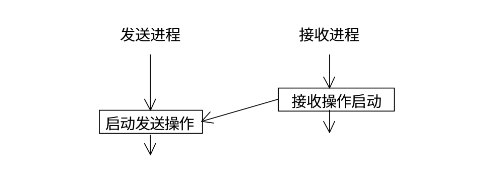

# 通信模式
<!-- toc -->

## 模式类别
在 MPI 中共有四种通信模式，如下表所示：

| 通信模式 | 发送 | 接受 |
|:----|:----|:-----|
| 标准通信模式（standard mode）| MPI_Send | MPI_Recv |
| 缓存通信模式（buffered mode）| MPI_Bsend | &nbsp; |
| 同步通信模式（synchronous mode）| MPI_Ssend |  &nbsp; |
| 就绪通信模式（ready mode） | MPI_Rsend | &nbsp; |

对于非标准的通信模式来说，只有发送操作，没有相应的接收操作。这四种模式的不同点主要表现在两个方面：
* 数据缓冲区（ buffering ）- 在消息被目标进程接收之前，数据存储的地方
* 同步（ synchronization ） - 怎样才算完成了发送操作

## 标准通信模式
使用 `MPI_Send` 进行消息发送的被成为标准通信模式，在这种模式下，是否使用数据缓冲区以及对数据缓冲区的管理都是由 MPI 自身决定的，用户无法控制。  
根据 MPI 是否选择缓存发送数据，可以将发送操作完成的标准可以分为下面两种情况：
* MPI 缓存数据 - 在这种情况下，发送操作不管接受操作是否执行，都可以进行，并且发送操作不需要接收操作收到数据就可以成功返回。
* MPI 不缓存数据 - 缓存数据是需要付出代价的，它会延长通信的时间，并且缓冲区并不是总能得到的，所以 MPI 可以选择不缓存数据。在这种情况下，只有当接收操作被调用，并且发送的数据完全到达接收缓冲区后，发送操作才算完成。需要注意的一点，对于非阻塞通信，发送操作虽然没有完成，但是发送调用可以正确返回，程序可以执行其他操作。

下面是标准通信模式的示意图



## 缓存通信模式
如果希望可以直接对通信缓冲区进行控制，我们可以使用缓存通信模式，下面是缓存发送的函数原型：
```c
int MPI_Bsend(
    void * buf,            // 发送缓冲区的起始地址
    int count,             // 发送数据的个数
    MPI_Datatype datatype, // 发送数据的数据类型
    int dest,              // 目标进程
    int tag,               // 消息标识
    MPI_Comm comm          // 通信域
)
```
`MPI_Bsend` 和 `MPI_Send` 的各参数含义相同，只是在使用 `MPI_Bsend` 之前需要用户手动指定缓冲区，假设我们不指定缓冲区就直接调用 `MPI_Bsend`，程序就会报下面的错误：
```bash
Fatal error in MPI_Bsend: Invalid buffer pointer, error stack:
MPI_Bsend(214).......: MPI_Bsend(buf=0x7ffdff7c2d84, count=1, MPI_INT, dest=1, tag=99, MPI_COMM_WORLD) failed
MPIR_Bsend_isend(311): Insufficient space in Bsend buffer; requested 4; total buffer size is 0
```
下面是缓存通信模式的示意图


在手动指定缓冲区时，有3件事需要我们考虑：  
1. 如何指定缓冲区
2. 应该指定多大的缓冲区
3. 怎么释放缓冲区

通过 `MPI_Buffer_attach` 我们可以指定缓冲区，下面是函数原型
```c
int MPI_Buffer_attach(
    void * buffer,  // 缓冲区地址
    int size        // 缓冲区大小（以字节为单位）
)
```
通过 `MPI_Buffer_detach` 我们可以回收缓冲区，下面是函数原型。
```c
int MPI_Buffer_detach(
    void ** buffer, // 缓冲区地址
    int * size      // 缓冲区大小
)
```
回收操作是阻塞调用，它会一直等到使用该缓存的消息发送完成之后才返回。只有调用返回之后，用户才可以重新使用该缓冲区或者将缓冲区释放。
缓冲区的大小的计算稍微繁琐一些。首先的一点，申请的总缓冲区的大小应该是所有未完成的 `MPI_Bsend` 所需缓冲区大小的总和。每个 `MPI_Bsend` 所需的缓冲区大小除了它所传输的数据大小还需要加上一个 `MPI_BSEND_OVERHEAD`。`MPI_BSEND_OVERHEAD` 指在 `MPI_Bsend` 调用时，该调用自身可能占用的最大空间。另外，我们需要使用 `MPI_Pack_size` 函数获取所传输数据大小，下面是函数原型：
```c
int MPI_Pack_size(
    int incount,            // 数据的个数
    MPI_Datatype datatype,  // 数据的类型
    MPI_Comm comm,          // 通信域
    int *size               // 数据所需要的空间，以字节为单位
)
```
 假设只有一个 `MPI_Bsend` 调用， 缓冲区大小计算如下所示：
```c
MPI_Bsend( ..., count=c, datatype=type,  ... );

MPI_Pack_size(c, type, comm, &s1);
size = s1 + MPI_BSEND_OVERHEAD;
```
假设有两个 `MPI_Bsend` 调用，缓冲区的大小计算如下所示：
```c
MPI_Bsend( ..., count=c1, datatype=type1,  ... );
MPI_Bsend( ..., count=c2, datatype=type2,  ... );

MPI_Pack_size(c1, type1, comm, &s1);
MPI_Pack_size(c2, type2, comm, &s2);
size = s1 + s2 + 2 * MPI_BSEND_OVERHEAD;
```
下面是使用 `MPI_Bsend` 的一个例子
```c
void bsend() {
    int rank;
    int a;
    int * tmp_buffer;
    MPI_Status status;
    MPI_Init(NULL, NULL);

    MPI_Comm_rank(MPI_COMM_WORLD, &rank);
    if(rank == 0) {
        a = 3;
        int size;
        // 计算缓冲区大小
        MPI_Pack_size(1, MPI_INT, MPI_COMM_WORLD, &size);
        size += MPI_BSEND_OVERHEAD;
        tmp_buffer = (int *)malloc(size);
        // 指定缓冲区
        MPI_Buffer_attach(tmp_buffer, size);
        MPI_Bsend(&a, 1, MPI_INT, 1, 99, MPI_COMM_WORLD);
        // 回收缓冲区
        MPI_Buffer_detach(&tmp_buffer, &size);
        free(tmp_buffer);
    }

    if(rank == 1) {
        MPI_Recv(&a, 1, MPI_INT, 0, 99, MPI_COMM_WORLD, &status);

        printf("a is %d\n", a);
    }
    MPI_Finalize();
}
```
## 同步通信模式
在同步通信模式中，发送进程必须要等到相应的接受进程开始后才可以正确返回。也就是说如果发送的数据一直没有被接受，发送进程就会一直处于等待状态。当同步发送操作返回之后，说明发送缓冲区中的数据已经全被系统缓冲区缓存，并且已经开始发送，这样发送缓冲区就可以被释放或者重新使用。下面是同步发送的函数原型：
```c
MPI_Ssend(
    void *buf,              // 发送缓冲区起始地址
    int count,              // 发送数据的个数
    MPI_Datatype datatype,  // 发送数据的数据类型
    int dest,               // 目标进程号
    int tag,                // 消息标识
    MPI_Comm comm           // 通信域
)
```

下面是同步通信模式的示意图：



下面是同步通信的示例：
```c
void ssend() {
    int rank;
    int a;
    MPI_Status status;
    MPI_Init(NULL, NULL);

    MPI_Comm_rank(MPI_COMM_WORLD, &rank);
    if(rank == 0) {
        a = 3;
        MPI_Ssend(&a, 1, MPI_INT, 1, 99, MPI_COMM_WORLD);
        printf("rank 0 has finished\n");
    }

    if(rank == 1) {
        MPI_Recv(&a, 1, MPI_INT, 0, 99, MPI_COMM_WORLD, &status);
        printf("a is %d\n", a);
    }
    MPI_Finalize();
}
```
## 就绪通信模式
在就绪通信模式中，只有当接收进程的接收操作已经启动时，才可以在发送进程启动发送操作。就绪通信模式的特殊之处在于它要求接受操作先于发送操作而被启动，因此在一个正确的程序中，一个就绪发送可以被一个标准发送替代，它对程序的语义没有影响，而对程序的性能有影响。下面是就绪发送的函数原型：
```c
MPI_Rsend(
    void * buf,
    int count,
    MPI_Datatype datatype,
    int dest,
    int tag,
    MPI_Comm comm
)
```
下面是就绪通信的示意图：


