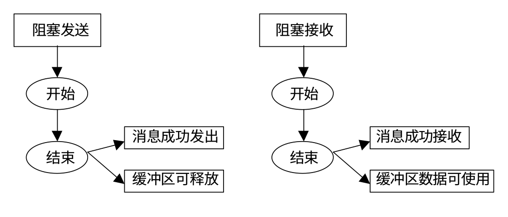
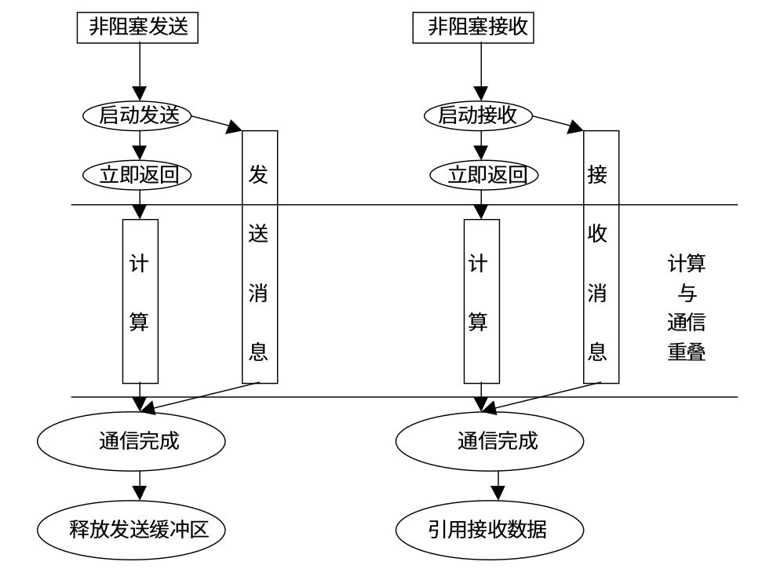
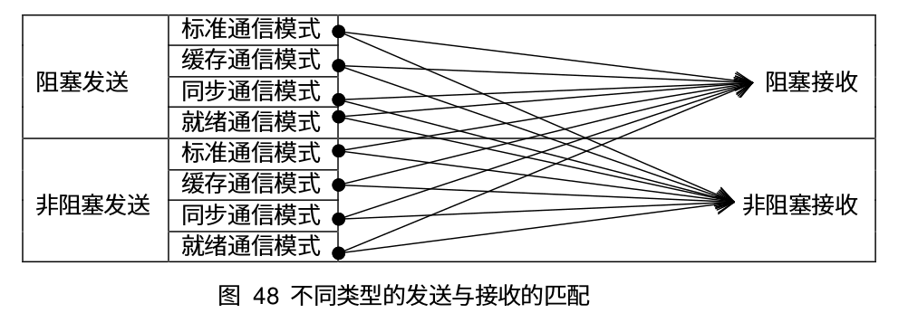

# 非阻塞通信

<!-- toc -->

## 简介
前面所讲的 `MPI_Send` 的通信模式为阻塞通信模式，在这种模式下，当一个阻塞通信正确返回后，可以得到下面的信息：
* 通信操作已正确完成，即消息已成功发出或者接收
* 通信占用的缓冲区可以使用，若是发送操作，则该缓冲区可以被其他操作更新，若是接收操作，那么该缓冲区中的数据已经完整，可以被正确使用。

下面是阻塞消息发送和接收的示意图：



在阻塞通信中，对于接收进程，在接受消息时，要保证按照消息发送的顺序接受消息.例如进程 0 向进程 1 连续发送了 2 条消息，记为消息0 和消息1，消息0先发送，这时即便消息1 先到达了进程1，进程1 也无法接受消息1，必须要等到消息0 被接收之后，消息1 才可以被接收。

与阻塞通信不同，非阻塞通信不必等到通信操作完成完成便可以返回，相对应的通信操作会交给特定的通信硬件去完成，在该通信硬件进行通信操作的同时，处理器可以同时进行计算。通过通信与计算的重叠，可以大大提高程序执行的效率。下面是非阻塞消息发送和接收的示意图：



## 非阻塞通信模式
在前面阻塞通信中，我们知道有 4 种基本的通信模式：
* 标准通信模式
* 缓存通信模式
* 同步通信模式
* 就绪通信模式

非阻塞通信和这四种通信模式相结合，也有四种不同的模式。同时针对某些通信是在**一个循环中重复执行**的情况， MPI 又引入了重复非阻塞通信方式，以进一步提高效率。对于重复非阻塞通信，和四种通信模式相结合，又有四种不同的具体形式。下面是具体的通信模式：

<table>
  <tr>
    <th colspan="2">通信模式</th>
    <th>发送</th>
    <th>接受</th>
  </tr>
  <tr>
    <td colspan="2">标准通信模式</td>
    <td>MPI_Isend</td>
    <td>MPI_IRecv</td>
  </tr>
  <tr>
    <td colspan="2">缓存通信模式</td>
    <td>MPI_Ibsend</td>
    <td></td>
  </tr>
  <tr>
    <td colspan="2">同步通信模式</td>
    <td>MPI_Issend</td>
    <td></td>
  </tr>
  <tr>
    <td colspan="2">就绪通信模式</td>
    <td>MPI_Irsend</td>
    <td></td>
  </tr>
  <tr>
    <td rowspan="4">重复非阻塞通信</td>
    <td>标准通信模式</td>
    <td>MPI_Send_init</td>
    <td>MPI_Recv_init</td>
  </tr>
  <tr>
    <td>缓存通信模式</td>
    <td>MPI_Bsend_init</td>
    <td></td>
  </tr>
  <tr>
    <td>同步通信模式</td>
    <td>MPI_Ssend_init</td>
    <td></td>
  </tr>
  <tr>
    <td>就绪通信模式</td>
    <td>MPI_Rsend_init</td>
    <td></td>
  </tr>
</table>

同时需要注意的是只要消息信封相吻合，并且符合有序接受的语义，任何形式的发送和任何形式的接受都可以匹配。



## 非阻塞通信函数
标准非阻塞发送操作
```c
MPI_Isend(
    void * buf,             // 发送缓冲区起始地址
    int count,              // 发送数据个数
    MPI_Datatype datatype,  // 发送数据的数据类型
    int dest,               // 目标进程号
    int tag,                // 消息标志
    MPI_Comm comm,          // 通信域
    MPI_Request * request   // 返回的非阻塞通信对象
)
```

标准非阻塞接收
```c
MPI_Irecv(
    void * buf,             // 接受缓冲区的起始地址
    int count,              // 接受数据的最大个数
    MPI_Datatype datatype,  // 数据类型
    int source,             // 源进程标识
    int tag,                // 消息标志
    MPI_Comm comm,          // 通信域
    MPI_Request * request   // 非阻塞通信对象
)
```

其余的三种通信模式和阻塞通信的函数形式类似，只是函数名称修改了一下，这里不做详细介绍。
```c
// 同步通信模式
MPI_Issend(void * buf, int count, MPI_Datatype datatype, int dest, int tag,
    MPI_Comm comm, MPI_Request * request)

// 缓存通信模式
MPI_Ibsend(void * buf, int count, MPI_Datatype datatype, int dest, int tag,
    MPI_Comm comm, MPI_Request * request)

// 就绪通信模式
MPI_Irsend(void * buf, int count, MPI_Datatype datatype, int dest, int tag,
    MPI_Comm comm, MPI_Request * request)

```
## 非阻塞通信完成
由于非阻塞通信返回并不意味着该通信已经完成，因此 MPI 提供了一个非阻塞通信对象 -- `MPI_Request` 来查询通信的状态。通过结合 `MPI_Request` 和下面的一些函数，我们等待或者检测阻塞通信。

对于单个非阻塞通信来说，可以使用下面两个函数来等待或者检测非阻塞通信。其中 `MPI_Wait` 会阻塞当前进程，一直等到相应的非阻塞通信完成之后再返回。`MPI_Test` 只是用来检测通信是否完成，它会立即返回，不会阻塞当前进程。如果通信完成，将 flag 置为 true，如果通信还没完成，则将 flag 置为 false。

```c
MPI_Wait(
    MPI_Request * request,      // 非阻塞通信对象
    MPI_Status * status         // 返回的状态
);

MPI_Test(
    MPI_Request * request,      // 非阻塞通信对象
    int * flag,                 // 操作是否完成，完成 - true，未完成 - false
    MPI_Status * status         // 返回的状态
);
```

对于多个非阻塞通信，MPI 也提供了相应的等待或者检测函数。`MPI_Waitany` 用来等待多个非阻塞对象中的任何一个非阻塞对象，`MPI_Waitall` 会等待所有的非阻塞通信完成，`MPI_Waitsome` 介于 `MPI_Waitany` 和 `MPI_Waitall`之间，只要有一个或者多个非阻塞通信完成，该调用就返回。
```c
MPI_Waitany(
    int count,                      // 非阻塞通信对象的个数
    MPI_Request * array_of_requests // 非阻塞通信对象数组
    int * index,                    // 通信完成的对象在数组中的索引
    MPI_Status * status             // 返回的状态
);

MPI_Waitall(
    int count，                     // 非阻塞通信对象的个数
    MPI_Request * array_of_requests // 费组摄通信对象数组
    MPI_Status * array_of_status    // 状态数组
);

MPI_Waitsome(
    int incount,                    // 非阻塞通信对象的个数
    MPI_Request * array_of_requests // 非阻塞通信对象数组
    int * outcount,                 // 已完成对象的数目
    int * array_of_indices          // 已完成对象的索引数组
    MPI_Status * array_of_statuses  // 已完成对象的状态数组
);
```
`MPI_Testany` 用来检测非阻塞通信中是否有任何一个对象已经完成（若有多个非阻塞通信对象完成则从中任取一个），这里只是检测，不会阻塞进程。`MPI_Testall` 用来检测是否所有的非阻塞通信都已经完成，`MPI_Testsome`用来检测有非阻塞通信已经完成。
```c
MPI_Testany(
    int count,                          // 非阻塞通信对象的个数
    MPI_Request * array_of_requests,    // 非阻塞通信对象数组
    int * index,                        // 非阻塞通信对象的索引
    int * flag,                         // 是否有对象完成
    MPI_Status * status                 // 返回的状态
);

MPI_Testall(
    int count,                          // 非阻塞通信对象个数
    MPI_Request * array_of_requests,    // 非阻塞通信对象数组
    int * flag,                         // 所有非阻塞通信对象是否都完成
    MPI_Status * array_of_statuses      // 状态数组
);

MPI_Testsome(
    int incount,                        // 非阻塞通信对象的个数
    MPI_Request * array_of_requests,    // 非阻塞通信对象数组
    int * outcount,                     // 已完成对象的数目
    int * array_of_indices,             // 已完成对象的索引数组
    MPI_Status * array_of_statuses      // 已完成对象的状态数组
)
```

## 基本示例
下面是非阻塞通通信的一个基本示例
```c
#include <stdio.h>
#include <stdlib.h>
#include "mpi.h"

void isend() {
    int rank;
    int n = 1000;
    int a[n];
    int i;
    int has_finished;
    MPI_Request request;
    MPI_Status status;

    MPI_Init(NULL, NULL);
    MPI_Comm_rank(MPI_COMM_WORLD, &rank);

    if(rank == 0) {
        for(i = 0; i < n; i++) {
            a[i] = i;
        }
        MPI_Isend(a, n, MPI_INT, 1, 99, MPI_COMM_WORLD, &request);
        MPI_Test(&request, &has_finished, &status);
        printf("before wait: send is %d\n", has_finished);
        MPI_Wait(&request, &status);
        MPI_Test(&request, &has_finished, &status);
        printf("after wait: send is %d\n", has_finished);

    }
    if(rank == 1) {
        MPI_Irecv(a, n, MPI_INT, 0, 99, MPI_COMM_WORLD, &request);
        MPI_Test(&request, &has_finished, &status);
        printf("before wait: receive is %d\n", has_finished);
        printf("a[10] is %d\n", a[10]);
        MPI_Wait(&request, &status);
        MPI_Test(&request, &has_finished, &status);
        printf("after wait: receive is %d\n", has_finished);
        printf("a[10] is %d\n", a[10]);
    }
    MPI_Finalize();
}

```

## 非阻塞通信取消
可以使用 `MPI_Cancel` 来取消已经调用的非阻塞通信，该调用立即返回。取消调用并不意味着相应的通信一定会被取消，如果非阻塞通信已经开始，那么它会正常完成。如果取消操作时非阻塞通信还没有开始，那么可以取消该阻塞通信，释放通信占用的资源。对于非阻塞通信，即使执行了取消操作，也必须调用 `MPI_Wait` 或者 `MPI_Test` 来释放对象。下面是 `MPI_Cancel` 的函数原型：
```c
int MPI_Cancel(MPI_Request *request);
```
如果一个非阻塞通信已经被执行了取消操作，那么该通信中的 `MPI_Wait` 和 `MPI_Test` 将释放非阻塞通信对象，并且在返回结果 status 中指明该通信已经被取消。

一个通信是否被取消，可以通过 `MPI_Test_cancelled` 来检查，如果返回结果 flag=1 则表明通信已被成功取消，负责说明通信还没有被取消。
```c
int MPI_Test_cancelled(
    MPI_Status * status,    // 状态
    int * flag              // 是否取消标志
);
```
下面是使用 `MPI_Cancel` 的一个示例
```c
#include <stdio.h>
#include <stdlib.h>
#include "mpi.h"

int main() {

    int rank;
    MPI_Request request;
    MPI_Status status;
    int value;
    int has_canceled;
    MPI_Init(NULL, NULL);
    MPI_Comm_rank(MPI_COMM_WORLD, &rank);

    if(rank == 0) {
        value = 10;
        MPI_Send(&value,1, MPI_INT, 1, 99, MPI_COMM_WORLD);
    } else if(rank == 1) {
        MPI_Irecv(&value, 1, MPI_INT, 0, 99, MPI_COMM_WORLD, &request);
        MPI_Cancel(&request);
        MPI_Wait(&request, &status);
        MPI_Test_cancelled(&status, &has_canceled);
        printf("has_canceled is %d\n", has_canceled);
        printf("value is %d\n", value);
        if(has_canceled) {
            MPI_Irecv(&value, 1, MPI_INT, 0, 99, MPI_COMM_WORLD, &request);
        }
        MPI_Wait(&request, &status);
        printf("value is %d\n", value);
    }

    MPI_Finalize();
}
```
